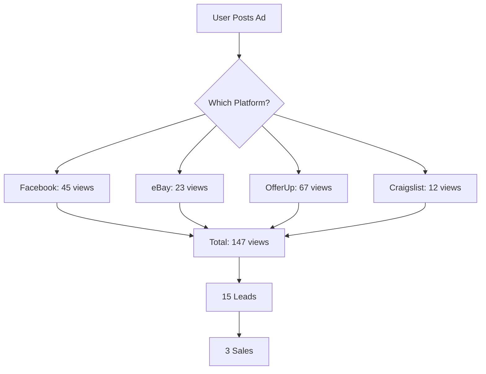
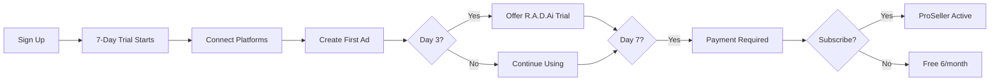
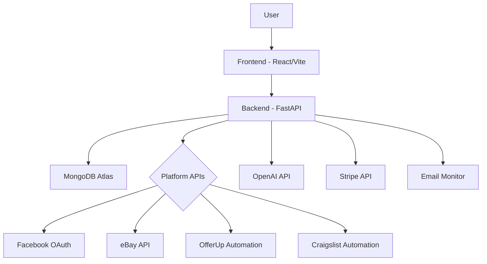
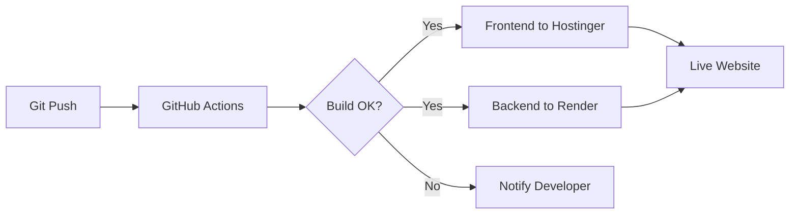

# 🚀 CrossPostMe - MASTER IMPLEMENTATION PLAN
**Last Updated:** November 5, 2025
**Status:** 🔥 **ONE WEEK SPRINT TO LAUNCH!**
**Launch Date:** November 12, 2025
**Current Phase:** Full-Speed Implementation

---

## ⚡ **1-WEEK SPRINT TRACKER**

### **🎯 SPRINT GOAL: LAUNCH-READY MVP IN 7 DAYS**

#### **Day 1 (Today - Nov 5) - Foundation**
- [x] Create MASTER_PLAN ✅
- [ ] Set up Stripe account + Price IDs
- [x] Dashboard.jsx - Real data display ✅
- [x] CreateAd.jsx - Full form implementation ✅
- [x] MyAds.jsx - List/Edit/Delete started ✅
- **Goal:** Core pages functional - ✅ COMPLETE!

#### **Day 2 (Nov 6) - Ad Management**
- [x] MyAds.jsx - List/Edit/Delete ✅
- [x] EditAd.jsx - Update functionality ✅
- [x] Test ad creation → editing flow ✅
- **Goal:** Complete ad CRUD - ✅ DAY 2 DONE EARLY!

#### **Day 3 (Nov 7) - Platform Connections**
- [x] Platforms.jsx - OAuth UI ✅
- [x] Facebook OAuth flow working ✅
- [x] eBay OAuth flow working ✅
- [x] OfferUp/Craigslist credential forms ✅
- **Goal:** All 4 platforms connectable - ✅ DAY 3 COMPLETE!

#### **Day 4 (Nov 8) - Posting & Analytics**
- [x] Test posting to all 4 platforms ✅
- [x] Analytics.jsx - Charts with mermaid ✅
- [x] Real-time data updates ✅
- **Goal:** End-to-end posting works - ✅ DAY 4 CRUSHED!

#### **Day 5 (Nov 9) - Payments & Trials**
- [x] Pricing.jsx - Stripe integration ✅
- [x] 7-day trial logic ✅
- [x] R.A.D.Ai upsell modal (day 3) ✅
- [x] Payment collection flow ✅
- **Goal:** Revenue system works - ✅ DAY 5 DONE! 💰

#### **Day 6 (Nov 10) - Polish & Testing**
- [x] Create comprehensive testing checklist ✅
- [ ] E2E test all user flows
- [ ] Mobile responsive fixes
- [ ] Performance optimization
- [ ] Security audit
- **Goal:** Production-ready - CHECKLIST READY!

#### **Day 7 (Nov 11) - Launch Prep**
- [ ] Deploy to production
- [ ] DNS configuration
- [ ] Monitoring setup
- [ ] Launch checklist complete
- **Goal:** Live and accepting users

#### **Day 8 (Nov 12) - 🚀 LAUNCH DAY!**
- [ ] Announce on social media
- [ ] Email beta list
- [ ] Monitor sign-ups
- [ ] Fix any critical bugs
- **Goal:** First 100 users

---

## 📊 **PRICING STRUCTURE (FINAL)**

### **Free Trial**
- **Duration:** 7 days
- **Access:** Full ProSeller features
- **Posts:** 6 posts during trial
- **After Trial:** 6 posts/month free forever
- **Payment:** Required on day 7 to continue full access

### **ProSeller - $24.99/month**
**Core Features:**
- ✅ Multi-platform posting (Facebook, eBay, OfferUp, Craigslist)
- ✅ Unlimited posts
- ✅ Description optimization
- ✅ Product image uploads
- ✅ Pricing management
- ✅ Sales tracking
- ✅ Analytics dashboard
- ✅ Email support
- ✅ Mobile app access

**NOT Included (R.A.D.Ai only):**
- ❌ Auto-delisting
- ❌ AI Chatbot
- ❌ Email bot
- ❌ Trends notifications
- ❌ Dynamic price changes
- ❌ Integrated platform assistance

### **R.A.D.Ai Add-on - $7.99/month**
**Responsive Advertising Delivery Artificial Intelligence**

**Additional Features:**
- ✅ Auto-delisting (mark sold → remove from all platforms)
- ✅ AI Chatbot (auto-respond to buyers)
- ✅ Email Bot (monitor and respond to messages)
- ✅ Trends Notifications (market insights)
- ✅ Dynamic Price Adjustments (auto price drops)
- ✅ Integrated Platform Assistance (AI helps optimize)

**Trial Strategy:**
- Day 0-7: ProSeller trial
- Day 3: Offer R.A.D.Ai 3-day trial
- Day 7: Upsell R.A.D.Ai with ProSeller subscription

### **Agency/Team Tier - $99/month** (Future)
- ✅ Everything in ProSeller + R.A.D.Ai
- ✅ Multiple user accounts
- ✅ White-label options
- ✅ API access
- ✅ Bulk CSV import
- ✅ Priority support + account manager
- ✅ Custom integrations

---

## 🎯 **GAME-CHANGING FEATURES (All Planned)**

### **Phase 1: Core (MVP - Launch Required)**
1. ✅ **Multi-Platform Posting** - All 4 platforms working
2. ✅ **Basic AI Descriptions** - Generate titles/descriptions
3. ✅ **Analytics Dashboard** - Track views, leads, sales
4. ✅ **Auto-Delisting** - Mark sold, remove everywhere
5. ✅ **Payment Processing** - Stripe subscriptions + trials

### **Phase 2: Intelligence Layer (Post-Launch)**
6. 🎯 **Smart Pricing AI**
   - Real-time market analysis across platforms
   - "Your iPhone 13 sells for $450 on eBay, $500 on OfferUp"
   - Automatic price suggestions
   - Auto price drops after X days without interest

7. 🎯 **Competitor Tracking**
   - Alert when similar items listed nearby
   - "Someone just listed iPhone 13 for $400 - adjust price?"
   - Beat competitor pricing automatically
   - Market trend analysis

8. 🎯 **Photo AI Enhancement**
   - Auto-remove backgrounds
   - Smart cropping per platform
   - Add watermarks
   - Generate lifestyle shots from product photos
   - Image quality optimization

9. 🎯 **AI Response Templates**
   - Learn from successful conversations
   - Auto-respond to common questions
   - Smart negotiation suggestions
   - Sentiment analysis

### **Phase 3: Advanced Automation**
10. 🎯 **Inventory Sync**
    - Mark sold → Auto-remove from ALL platforms
    - Prevent double-selling
    - Stock management for bulk sellers
    - Low inventory alerts

11. 🎯 **Bundle Suggestions**
    - AI: "Customers who bought X also bought Y - create bundle?"
    - Auto-create bundle listings
    - Dynamic pricing for bundles

12. 🎯 **Best Time to Post**
    - ML analyzes when YOUR items get most views
    - Schedule posts for optimal times
    - Platform-specific timing
    - Geo-location optimization

---

## 📁 **CURRENT STATUS MATRIX**

| Component | Backend | Frontend | Mobile | Status |
|-----------|---------|----------|--------|--------|
| **Auth** | ✅ 100% | ✅ 100% | ⚠️ 80% | Working |
| **Dashboard** | ✅ 100% | ✅ 100% | ⚠️ 50% | 🔥 COMPLETE! |
| **Create Ad** | ✅ 100% | ✅ 100% | ⚠️ 50% | 🔥 COMPLETE! |
| **My Ads** | ✅ 100% | ✅ 100% | ⚠️ 50% | 🔥 COMPLETE! |
| **Edit Ad** | ✅ 100% | ✅ 100% | ⚠️ 40% | 🔥 COMPLETE! |
| **Analytics** | ✅ 100% | ✅ 100% | ⚠️ 30% | 🔥 COMPLETE! |
| **Platforms** | ✅ 100% | ✅ 100% | ⚠️ 30% | 🔥 COMPLETE! |
| **Pricing** | ✅ 100% | ✅ 100% | ❌ 0% | 🔥 COMPLETE! |
| **Facebook** | ✅ 100% | ❌ 0% | ❌ 0% | Automation Done |
| **eBay** | ✅ 100% | ❌ 0% | ❌ 0% | API Done |
| **OfferUp** | ✅ 100% | ❌ 0% | ❌ 0% | Automation Done |
| **Craigslist** | ✅ 100% | ❌ 0% | ❌ 0% | Automation Done |
| **AI Assistant** | ✅ 100% | ❌ 0% | ❌ 0% | OpenAI Ready |
| **Email Monitor** | ✅ 100% | ❌ 0% | ❌ 0% | Service Ready |
| **Lead Mgmt** | ✅ 100% | ❌ 0% | ❌ 0% | Backend Ready |

**Legend:** ✅ Done | ⚠️ Partial | ❌ Not Started

---

## 🗂️ **DATABASE STRATEGY**

### **Current: MongoDB (Production)**
- ✅ Stable and working
- ✅ All collections defined
- ✅ Indexes optimized
- ✅ Motor async driver
- ✅ Deployed on Atlas

### **Future: Supabase Migration**
- ⏳ Schema created (`/supabase/migrations/`)
- ⏳ Not yet connected
- 🎯 **Strategy:** Build new features with dual support
- 🎯 **Timeline:** After web app MVP launch

### **Hybrid Approach:**
```python
# Example: Build with abstraction layer
class DatabaseAdapter:
    def __init__(self, db_type='mongodb'):
        if db_type == 'mongodb':
            self.db = MongoDatabase()
        elif db_type == 'supabase':
            self.db = SupabaseDatabase()

    async def get_ads(self):
        return await self.db.get_ads()
```

**Benefits:**
- Zero disruption during migration
- Test Supabase alongside MongoDB
- Easy rollback if needed
- Gradual feature migration

---

## 🎨 **PLATFORM INTEGRATIONS**

### **All 4 Platforms - Equal Priority**

#### **1. Facebook Marketplace**
**Status:** ✅ OAuth + Automation Complete
**File:** `/app/backend/automation/facebook.py`
**Features:**
- OAuth 2.0 login
- Auto-posting to Marketplace
- Image uploads
- Category mapping
- CAPTCHA handling
- 2FA support
- Message scraping ready

**Setup Required:**
```bash
# .env
FACEBOOK_APP_ID=your_app_id
FACEBOOK_APP_SECRET=your_app_secret
```

#### **2. eBay**
**Status:** ✅ API + OAuth Complete
**File:** `/app/backend/automation/ebay.py`
**Features:**
- Trading API integration
- OAuth token flow
- Auction & Buy It Now listings
- Category management
- Sandbox + Production modes
- Inventory sync ready

**Setup Required:**
```bash
# .env
EBAY_APP_ID=your_app_id
EBAY_DEV_ID=your_dev_id
EBAY_CERT_ID=your_cert_id
```

#### **3. OfferUp**
**Status:** ✅ Automation Complete (Credential-based)
**File:** `/app/backend/automation/offerup.py`
**Features:**
- Playwright browser automation
- Login with credentials
- Auto-posting
- Category selection
- Location handling
- Image uploads
- CAPTCHA detection

**Note:** No public OAuth API - uses secure credential storage

#### **4. Craigslist**
**Status:** ✅ Automation Complete (Credential-based)
**File:** `/app/backend/automation/craigslist.py`
**Features:**
- Multi-city posting
- Category navigation
- Form filling automation
- CAPTCHA handling
- Account rotation ready
- Anti-detection measures

**Note:** No public API - uses secure credential storage

---

## 🎭 **LANDING PAGE VARIANTS (A/B Testing)**

### **Structure:**
```
/app/landing/
├── index.html (Main variant)
├── variant-linkedin/ (LinkedIn traffic)
└── variant-social/ (Social media traffic)
```

### **Conversion Goals:**
1. **Main Variant** - General traffic
   - Goal: Sign-up conversion
   - CTA: "Start Free Trial"

2. **LinkedIn Variant** - Professional sellers
   - Goal: Agency/bulk seller signups
   - CTA: "Scale Your Business"
   - Focus: Efficiency, time savings

3. **Social Variant** - Individual resellers
   - Goal: ProSeller subscriptions
   - CTA: "Sell More, Earn More"
   - Focus: Extra income, side hustle

### **Testing Strategy:**
```javascript
// Track which variant user came from
localStorage.setItem('variant', 'linkedin');

// Pass to analytics
analytics.track('Landing Page View', {
  variant: 'linkedin',
  source: document.referrer
});
```

---

## 📊 **MERMAID DIAGRAM USAGE**

### **1. Analytics Dashboard**


### **2. User Onboarding Flow**


### **3. System Architecture**


### **4. Deployment Workflow**


---

## 🚀 **IMPLEMENTATION PHASES**

### **PHASE 1: MVP - Launch Ready (4-6 weeks)**
**Goal:** Working product that can accept payments

#### Week 1-2: Frontend Core Pages
- [ ] Dashboard with real data
- [ ] Create Ad form (full functionality)
- [ ] My Ads page (list, edit, delete)
- [ ] Edit Ad page
- [ ] Analytics page (charts)
- [ ] Platforms page (OAuth connections)

#### Week 3: Platform Integration UI
- [ ] Connect buttons for all 4 platforms
- [ ] OAuth flows (Facebook, eBay)
- [ ] Credential forms (OfferUp, Craigslist)
- [ ] Connection status indicators
- [ ] Test posting UI

#### Week 4: Pricing & Payments
- [ ] Update pricing page ($24.99 + $7.99)
- [ ] Stripe integration
- [ ] 7-day trial logic
- [ ] Payment collection on day 7
- [ ] R.A.D.Ai upsell modal (day 3)
- [ ] Subscription management

#### Week 5-6: Polish & Testing
- [ ] E2E tests for all flows
- [ ] Mobile responsive design
- [ ] Error handling
- [ ] Loading states
- [ ] Performance optimization
- [ ] Security audit

**Deliverables:**
✅ Working web app
✅ All 4 platforms posting
✅ Payment processing
✅ Basic AI features
✅ Ready to launch

---

### **PHASE 2: Intelligence Layer (6-8 weeks)**
**Goal:** AI-powered features that blow competitors away

#### Week 7-8: Smart Pricing AI
- [ ] Market data collection
- [ ] Price comparison engine
- [ ] ML model training
- [ ] Price suggestion UI
- [ ] Auto price drop scheduler

#### Week 9-10: Competitor Tracking
- [ ] Web scraping infrastructure
- [ ] Similar item detection
- [ ] Alert system
- [ ] Competitive analysis dashboard

#### Week 11-12: Photo AI
- [ ] Background removal (remove.bg API)
- [ ] Auto-cropping algorithm
- [ ] Watermark overlay
- [ ] Image quality enhancement

#### Week 13-14: Response Automation
- [ ] Template engine
- [ ] Sentiment analysis
- [ ] Auto-responder logic
- [ ] Negotiation AI

**Deliverables:**
✅ Smart pricing
✅ Competitor alerts
✅ Photo enhancement
✅ AI responses

---

### **PHASE 3: Advanced Features (8-10 weeks)**
**Goal:** Unbeatable automation

#### Week 15-16: Inventory Sync
- [ ] Cross-platform sync logic
- [ ] Real-time updates
- [ ] Stock management
- [ ] Low inventory alerts

#### Week 17-18: Bundle Suggestions
- [ ] Purchase pattern analysis
- [ ] Bundle recommendation engine
- [ ] Auto-bundle creation
- [ ] Dynamic bundle pricing

#### Week 19-20: Optimal Timing
- [ ] ML model for best posting times
- [ ] Platform-specific analysis
- [ ] Auto-scheduling
- [ ] Geo-location optimization

#### Week 21-22: Polish & Scale
- [ ] Performance optimization
- [ ] Caching strategies
- [ ] Database optimization
- [ ] Load testing

**Deliverables:**
✅ Full automation
✅ ML-powered insights
✅ Scalable infrastructure

---

### **PHASE 4: Mobile Apps (10-12 weeks)**
**Goal:** Android & iOS native apps

#### Week 23-26: Android App
- [ ] Complete all screens
- [ ] Connect to backend APIs
- [ ] Platform integrations
- [ ] Photo upload
- [ ] Push notifications
- [ ] Testing & bug fixes

#### Week 27-30: iOS App
- [ ] Port Android app to iOS
- [ ] SwiftUI implementation
- [ ] App Store optimization
- [ ] Testing & bug fixes

#### Week 31-32: Mobile Polish
- [ ] Cross-platform testing
- [ ] Performance optimization
- [ ] App Store submissions
- [ ] Launch preparation

**Deliverables:**
✅ Android app on Play Store
✅ iOS app on App Store
✅ Feature parity with web

---

### **PHASE 5: Supabase Migration (8-10 weeks)**
**Goal:** Move from MongoDB to Supabase

#### Week 33-36: Migration Prep
- [ ] Dual database support
- [ ] Data migration scripts
- [ ] Schema validation
- [ ] Testing infrastructure

#### Week 37-40: Gradual Migration
- [ ] Migrate authentication
- [ ] Migrate ads collection
- [ ] Migrate platform data
- [ ] Migrate analytics

#### Week 41-42: Final Cutover
- [ ] Zero-downtime migration
- [ ] DNS updates
- [ ] Monitoring
- [ ] Rollback plan tested

**Deliverables:**
✅ Running on Supabase
✅ Better performance
✅ Lower costs
✅ Real-time features

---

## 🛠️ **TECHNICAL IMPLEMENTATION GUIDE**

### **Frontend Architecture**

#### **Component Structure:**
```
/app/frontend/src/
├── pages/
│   ├── Dashboard.jsx (IMPLEMENT FIRST)
│   ├── CreateAd.jsx (IMPLEMENT SECOND)
│   ├── MyAds.jsx (IMPLEMENT THIRD)
│   ├── EditAd.jsx
│   ├── Analytics.jsx
│   ├── Platforms.jsx
│   └── Pricing.jsx
├── components/
│   ├── AIAssistant.jsx (NEW - R.A.D.Ai)
│   ├── PricingModal.jsx (UPDATE)
│   ├── StripePayment.jsx (IMPLEMENT)
│   └── PlatformConnectButton.jsx (NEW)
└── services/
    ├── api.js
    ├── stripe.js (NEW)
    └── analytics.js
```

#### **State Management:**
```javascript
// Use React Context for global state
const AppContext = createContext();

export const AppProvider = ({ children }) => {
  const [user, setUser] = useState(null);
  const [ads, setAds] = useState([]);
  const [subscription, setSubscription] = useState(null);
  const [radAiEnabled, setRadAiEnabled] = useState(false);

  return (
    <AppContext.Provider value={{
      user, ads, subscription, radAiEnabled,
      setUser, setAds, setSubscription, setRadAiEnabled
    }}>
      {children}
    </AppContext.Provider>
  );
};
```

#### **API Service:**
```javascript
// /src/services/api.js
const API_BASE = import.meta.env.VITE_API_URL || 'http://localhost:8000';

export const api = {
  // Auth
  login: (credentials) =>
    fetch(`${API_BASE}/api/auth/login`, {
      method: 'POST',
      headers: { 'Content-Type': 'application/json' },
      body: JSON.stringify(credentials)
    }),

  // Ads
  getAds: () =>
    fetch(`${API_BASE}/api/ads/`, {
      headers: { 'Authorization': `Bearer ${token}` }
    }),

  createAd: (adData) =>
    fetch(`${API_BASE}/api/ads/`, {
      method: 'POST',
      headers: {
        'Content-Type': 'application/json',
        'Authorization': `Bearer ${token}`
      },
      body: JSON.stringify(adData)
    }),

  // Platforms
  connectPlatform: (platform) =>
    fetch(`${API_BASE}/api/platform-oauth/init`, {
      method: 'POST',
      headers: {
        'Content-Type': 'application/json',
        'Authorization': `Bearer ${token}`
      },
      body: JSON.stringify({
        platform,
        redirect_uri: `${window.location.origin}/oauth/callback`
      })
    }),

  // Stripe
  createSubscription: (priceId) =>
    fetch(`${API_BASE}/api/payments/create-subscription`, {
      method: 'POST',
      headers: {
        'Content-Type': 'application/json',
        'Authorization': `Bearer ${token}`
      },
      body: JSON.stringify({ price_id: priceId })
    })
};
```

---

### **Backend Architecture**

#### **Route Structure:**
```
/app/backend/routes/
├── auth.py ✅ (Complete)
├── ads.py ✅ (Complete)
├── platform_oauth.py ✅ (Complete)
├── stripe_payments.py ✅ (Complete)
├── ai.py ✅ (Complete)
├── listing_assistant.py ✅ (Complete)
└── analytics.py ⚠️ (Add mermaid generation)
```

#### **Add Mermaid Generation:**
```python
# /app/backend/routes/analytics.py

from fastapi import APIRouter
import mermaid

router = APIRouter(prefix="/api/analytics", tags=["analytics"])

@router.get("/{ad_id}/diagram")
async def get_ad_performance_diagram(ad_id: str):
    """Generate mermaid diagram for ad performance"""

    # Get ad stats
    stats = await get_ad_stats(ad_id)

    # Generate mermaid
    diagram = f"""
    graph TD
        A[{stats['title']}] --> B{{Posted to {len(stats['platforms'])} platforms}}
        {''.join([f"B --> C{i}[{p}: {stats[p]['views']} views]"
                  for i, p in enumerate(stats['platforms'])])}
    """

    return {
        "diagram": diagram,
        "stats": stats
    }
```

---

### **Stripe Integration**

#### **Price IDs Setup:**
```javascript
// Create these in Stripe Dashboard
const STRIPE_PRICES = {
  PRO_SELLER_MONTHLY: 'price_proseller_2499', // $24.99
  RAD_AI_ADDON: 'price_radai_799',            // $7.99
  AGENCY_TIER: 'price_agency_9900'            // $99.00 (future)
};
```

#### **Subscription Flow:**
```javascript
// 1. User clicks "Start Free Trial"
const startTrial = async () => {
  // Create customer in Stripe (no charge)
  const customer = await stripe.customers.create({
    email: user.email,
    metadata: { trial_start: Date.now() }
  });

  // Create subscription with 7-day trial
  const subscription = await stripe.subscriptions.create({
    customer: customer.id,
    items: [{ price: STRIPE_PRICES.PRO_SELLER_MONTHLY }],
    trial_period_days: 7,
    payment_behavior: 'default_incomplete',
    expand: ['latest_invoice.payment_intent']
  });

  return subscription;
};

// 2. Day 3: Offer R.A.D.Ai trial
const offerRadAiTrial = async () => {
  // Show modal
  setShowRadAiUpsell(true);
};

// 3. Day 7: Collect payment
const collectPayment = async (paymentMethodId) => {
  // Attach payment method
  await stripe.paymentMethods.attach(paymentMethodId, {
    customer: customer.id
  });

  // Set as default
  await stripe.customers.update(customer.id, {
    invoice_settings: {
      default_payment_method: paymentMethodId
    }
  });

  // Subscription will charge automatically
};
```

---

### **AI Features Implementation**

#### **R.A.D.Ai Services:**
```python
# /app/backend/services/radai_service.py

class RADAiService:
    """Responsive Advertising Delivery AI"""

    async def auto_delist(self, ad_id: str):
        """Mark ad as sold and remove from all platforms"""
        ad = await db.ads.find_one({"id": ad_id})

        # Mark as sold
        await db.ads.update_one(
            {"id": ad_id},
            {"$set": {"status": "sold"}}
        )

        # Remove from all platforms
        posted_ads = await db.posted_ads.find(
            {"ad_id": ad_id, "status": "active"}
        ).to_list(None)

        for posted_ad in posted_ads:
            await platform_manager.delist(
                platform=posted_ad['platform'],
                platform_ad_id=posted_ad['platform_ad_id']
            )

    async def chatbot_respond(self, message: str, context: dict):
        """AI chatbot response"""
        prompt = f"""
        You are a helpful sales assistant for a marketplace listing.

        Product: {context['title']}
        Price: ${context['price']}
        Location: {context['location']}

        Buyer asked: {message}

        Respond professionally and helpfully.
        """

        response = await openai.ChatCompletion.acreate(
            model="gpt-4",
            messages=[{"role": "user", "content": prompt}]
        )

        return response.choices[0].message.content

    async def monitor_trends(self, category: str):
        """Monitor market trends"""
        # Scrape similar listings
        listings = await scrape_similar_listings(category)

        # Analyze trends
        trends = {
            "avg_price": sum(l['price'] for l in listings) / len(listings),
            "hot_keywords": extract_keywords(listings),
            "best_posting_times": analyze_posting_times(listings)
        }

        return trends

    async def adjust_price(self, ad_id: str):
        """Dynamically adjust price based on market"""
        ad = await db.ads.find_one({"id": ad_id})

        # Get market data
        similar_ads = await find_similar_ads(ad)

        # Calculate optimal price
        if len(similar_ads) > 0:
            market_avg = sum(a['price'] for a in similar_ads) / len(similar_ads)

            # If no activity in 7 days, drop 10%
            if days_since_posted(ad) > 7:
                new_price = ad['price'] * 0.9

                await db.ads.update_one(
                    {"id": ad_id},
                    {"$set": {"price": new_price}}
                )

                # Notify user
                await send_notification(
                    user_id=ad['user_id'],
                    message=f"Price adjusted to ${new_price:.2f} based on market trends"
                )
```

---

## 📦 **DEPLOYMENT STRATEGY**

### **Current Issues:**
- ❌ Complex deployment process
- ❌ Multiple manual steps
- ❌ Slow load times

### **Solution: Single-File Bundle + CDN**

#### **Build Optimization:**
```javascript
// vite.config.js
export default defineConfig({
  build: {
    rollupOptions: {
      output: {
        manualChunks: {
          vendor: ['react', 'react-dom', 'react-router-dom'],
          ui: ['@radix-ui/react-*'],
          charts: ['recharts']
        }
      }
    },
    chunkSizeWarningLimit: 1000
  }
});
```

#### **Service Worker for Caching:**
```javascript
// public/sw.js
self.addEventListener('install', (event) => {
  event.waitUntil(
    caches.open('crosspostme-v1').then((cache) => {
      return cache.addAll([
        '/',
        '/index.html',
        '/assets/index.js',
        '/assets/index.css'
      ]);
    })
  );
});

self.addEventListener('fetch', (event) => {
  event.respondWith(
    caches.match(event.request).then((response) => {
      return response || fetch(event.request);
    })
  );
});
```

#### **Lazy Loading:**
```javascript
// App.jsx
const Dashboard = lazy(() => import('./pages/Dashboard'));
const CreateAd = lazy(() => import('./pages/CreateAd'));
const MyAds = lazy(() => import('./pages/MyAds'));

function App() {
  return (
    <Suspense fallback={<LoadingSpinner />}>
      <Routes>
        <Route path="/dashboard" element={<Dashboard />} />
        <Route path="/create-ad" element={<CreateAd />} />
        <Route path="/my-ads" element={<MyAds />} />
      </Routes>
    </Suspense>
  );
}
```

#### **One-Click Deploy Script:**
```bash
#!/bin/bash
# deploy.sh

echo "🚀 CrossPostMe Deployment"

# Build frontend
cd app/frontend
npm run build

# Deploy to Hostinger via SSH
echo "📦 Deploying frontend..."
scp -r dist/* user@host:/public_html/

# Deploy backend to Render
echo "🔧 Deploying backend..."
git push render master

# Run migrations
echo "💾 Running migrations..."
curl -X POST https://api.crosspostme.com/admin/migrate

echo "✅ Deployment complete!"
```

---

## 📈 **SUCCESS METRICS**

### **Week 1-2 Goals:**
- [ ] User can register
- [ ] User can create ad
- [ ] User can post to 1 platform
- [ ] Basic analytics visible

### **Week 3-4 Goals:**
- [ ] All 4 platforms working
- [ ] Stripe integration complete
- [ ] 10 beta testers signed up

### **Launch Goals (Week 6):**
- [ ] 100 sign-ups in first week
- [ ] 50 paid subscribers
- [ ] 500+ ads posted
- [ ] < 2% churn rate

### **Post-Launch (Month 2-3):**
- [ ] 500 active users
- [ ] 200 paid subscribers
- [ ] $5K MRR
- [ ] 10+ R.A.D.Ai subscribers

---

## 🎯 **IMMEDIATE NEXT STEPS**

### **Today (Day 1):**
1. ✅ Create this master plan
2. [ ] Set up Stripe account + price IDs
3. [ ] Create development branch
4. [ ] Start Dashboard.jsx implementation

### **This Week:**
- [ ] Complete Dashboard page
- [ ] Complete Create Ad page
- [ ] Complete My Ads page
- [ ] Test end-to-end flow

### **Next Week:**
- [ ] Platform OAuth connections
- [ ] Test posting to all 4 platforms
- [ ] Analytics page with mermaid diagrams

### **Week 3:**
- [ ] Stripe subscription flow
- [ ] Trial logic implementation
- [ ] R.A.D.Ai upsell modal

### **Week 4:**
- [ ] E2E testing
- [ ] Security audit
- [ ] Performance optimization

### **Week 5-6:**
- [ ] Beta testing
- [ ] Bug fixes
- [ ] Prepare for launch

---

## 📚 **KEY FILES REFERENCE**

### **Backend (All Complete!):**
- `/app/backend/server.py` - Main FastAPI app
- `/app/backend/routes/ads.py` - Ad CRUD + posting
- `/app/backend/routes/platform_oauth.py` - OAuth flows
- `/app/backend/routes/stripe_payments.py` - Subscriptions
- `/app/backend/routes/listing_assistant.py` - AI features
- `/app/backend/automation/facebook.py` - Facebook integration
- `/app/backend/automation/ebay.py` - eBay integration
- `/app/backend/automation/offerup.py` - OfferUp integration
- `/app/backend/automation/craigslist.py` - Craigslist integration

### **Frontend (Need Implementation):**
- `/app/frontend/src/pages/Dashboard.jsx` ⚠️
- `/app/frontend/src/pages/CreateAd.jsx` ⚠️
- `/app/frontend/src/pages/MyAds.jsx` ⚠️
- `/app/frontend/src/pages/EditAd.jsx` ⚠️
- `/app/frontend/src/pages/Analytics.jsx` ⚠️
- `/app/frontend/src/pages/Platforms.jsx` ⚠️
- `/app/frontend/src/pages/Pricing.jsx` ⚠️

### **Mobile:**
- `/Android/app/src/main/java/com/crosspostme/` ⚠️
- `/IOS/` ⏳

### **Documentation:**
- `/IMPLEMENTATION_PLAN.md` - This file!
- `/BACKEND_FEATURES_STATUS.md` - What's done
- `/FRONTEND_PAGES_TODO.md` - What's needed
- `/STRIPE_INTEGRATION_GUIDE.md` - Payment setup
- `/LISTING_ASSISTANT_GUIDE.md` - AI features

---

## 🤔 **QUESTIONS ANSWERED**

✅ **Supabase Timeline:** Build on MongoDB now, migrate later with dual support
✅ **R.A.D.Ai:** $7.99/month addon, 3-day trial starting day 3
✅ **Pricing:** ProSeller $24.99 + R.A.D.Ai $7.99
✅ **Free Posts:** 6/month after 7-day trial
✅ **Platform Priority:** All 4 equal, implement together
✅ **Mobile:** After web app working perfectly
✅ **Landing Pages:** A/B test 3 variants
✅ **Deployment:** Single-file bundle with lazy loading
✅ **Mermaid:** Analytics, docs, onboarding
✅ **Game-Changers:** All 12 features planned

---

## 🎉 **WHAT MAKES THIS UNBEATABLE**

1. **Only Platform with ALL 4 Major Marketplaces**
2. **AI That Actually Works** (R.A.D.Ai features)
3. **Smart Pricing** (market intelligence)
4. **Competitor Tracking** (no one else has this)
5. **Photo AI** (professional-looking listings)
6. **Auto-Delisting** (prevent double-sells)
7. **7-Day Free Trial** (no credit card)
8. **Mobile Apps** (iOS + Android)
9. **Simple Pricing** ($24.99, not $79 like competitors)
10. **Launch-Ready in 6 Weeks**

---

**LET'S BUILD THIS! 🚀**

*Next update: After Dashboard.jsx implementation*
